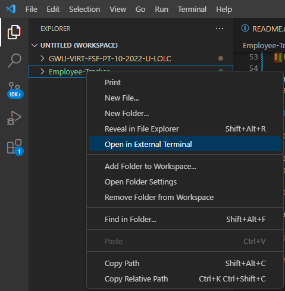
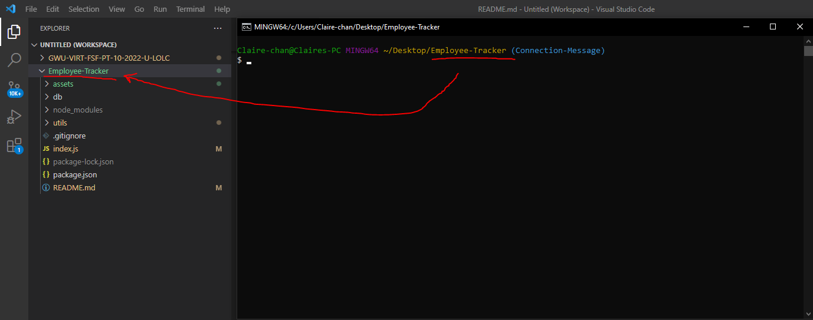
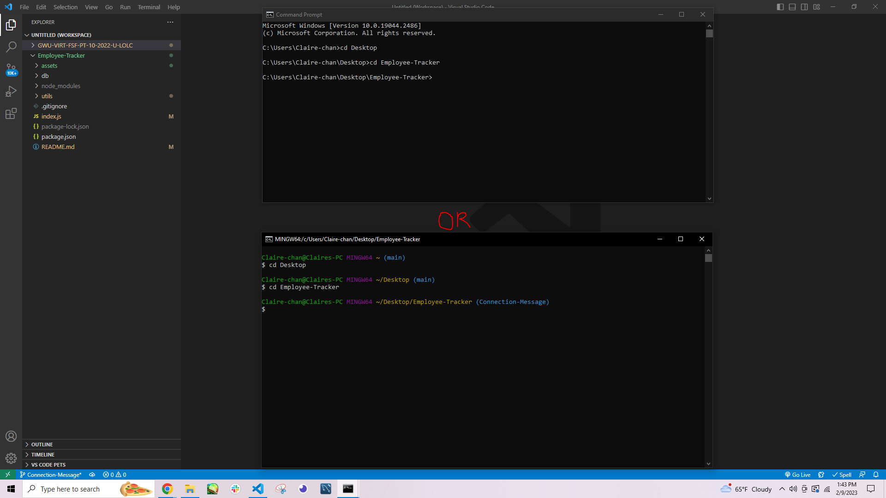

# Employee Tracker

## Description

This project is a command-line application that functions as a content management system (CMS), able to manage a company's employee database. The main menu will allow the user to view all departments, view all roles, view all employees, add a department, add a role, add an employee, and update an employee's role.
<!-- BONUS: Update employee managers. View employees by manager. View employees by department. Delete departments, roles, and employees. View the total utilized budget of a department—in other words, the combined salaries of all employees in that department.-->

This project utilizes [Node.js version 16.18.0](https://nodejs.org/en/) and the [Inquirer version 8.2.4](https://www.npmjs.com/package/inquirer) package from [npm, Inc.](https://www.npmjs.com/) to create a main menu for content management while utilizing the [Node MySQL 2 version 3.1.0](https://www.npmjs.com/package/mysql2) package from [npm, Inc.](https://www.npmjs.com/) to access the database for displaying and editing employee records.

## Table of Contents
- [Installation](#installation)
    - [Git/Git Bash](#gitgit-bash---strongly-recommended)
    - [Visual Studio Code](#visual-studio-code-vsc---strongly-recommended)
    - [Node](#node-version-16---required-to-download-node-dependencies-ie-inquirer-and-my-sql-2)
    - [Inquirer](#inquirer-version-824---required-to-prompt-questions)
    - [Node My SQL 2](#node-my-sql-2-version-310---required-for-testing)
- [Usage](#usage---for-the-purposes-of-this-demonstration-git-bash-will-be-used-as-my-preferred-terminal)
- [Credits](#credits)
- [Questions](#questions)

## Installation

Make sure the following are downloaded:

### `Git/GitBash` - *Strongly Recommended*
* While this application can be run using with the default **command prompt**, it is easier to clone this repository by using Git/GitBash, which can be downloaded [here](https://git-scm.com/downloads).

### `Visual Studio Code [VSC]` - *Strongly Recommended*

* If you'd like to make changes to this code or the README file generated, Visual Studio Code is recommended and can be downloaded for free [here](https://code.visualstudio.com/download).

### `Node version 16` - **REQUIRED** to download node dependencies (i.e. Inquirer and My SQL 2)
* Go to [Node's homepage, https://nodejs.org/en/](https://nodejs.org/en/), then [Downloads](https://nodejs.org/en/download/) and scroll down to the [Previous Releases](https://nodejs.org/en/download/releases/) bullet point. 

* Toggle between the results until the desired version 16 package and click Download. This application was developed with [Node.js version 16.18.0](https://nodejs.org/dist/v16.18.0/), click on [node-v16.18.0-x64.msi](https://nodejs.org/download/release/v16.18.0/node-v16.18.0-x64.msi) to download.

* The Full-Stack Blog also has [instructions on how to download Node](https://coding-boot-camp.github.io/full-stack/nodejs/how-to-install-nodejs).

### `Inquirer version 8.2.4` - **REQUIRED** to prompt questions

* This **MUST** be installed into this repository, start by opening the command line interface.

* If you have Visual Code Studio, add the README Generator repository to the workspace. Then, go to 'Settings' either through the cog icon in the lower left corner and clicking Settings, go to File -> Preferences -> Settings in the menu bar, or the key combo of Ctrl+,

* Then, change the settings in "Terminal: Explorer Kind" to "external" in the drop down menu.

        
* Change the filepath of the "Terminal > External: [respective operating system]" settings to the preferred command line interface program (either your system's Command Prompts's file path or Git/Git Bash's file path)

* After that, right-click the repository and select "Open in External Terminal"

* If you do not have VSC, open the preferred terminal.

* Use "cd Desktop" to first reach the Desktop, cd stands for change directory.

* Continue using "cd" to navigate through the file path to reach the location of this repository on your computer.

* Once this repository has been reached, type in `npm i inquirer@8.2.4` into the terminal and hit `Enter`.

### `Node My SQL 2 version 3.1.0` - **REQUIRED** for testing

* Follow the same methods from [Inquirer v8.2.4 Installation Section](#inquirer-version-824---required-to-prompt-questions) to reach this repository if you've already exited out of the command-line, then type in `npm i mysql2` and hit `Enter`.

## Usage - for the purposes of this demonstration, Git Bash will be used as my preferred terminal

* A video of this application's usage can be viewed [here](#blank). If the link is non-functional, a copy of the video can be found in the "assets" folder.

* To use this application, start by using either of the two methods described in the [Inquirer v8.2.4 Installation Section](#inquirer-version-824---required-to-prompt-questions) to reach this repository through the preferred terminal.

Method 1:

Method 2:

* Once this repository has been reached, type in `node index.js` into the terminal and hit `Enter`. This will start the questions prompt. Answer the questions as according to the project in question.

* The first question will ...

## Credits

* Code for inquirer validation as a separate function credit goes to [udalmik](https://stackoverflow.com/users/1584167/udalmik):   https://stackoverflow.com/questions/57321266/how-to-test-inquirer-validation

* `string.length()` method supplemental lesson by [W3 Schools](https://www.w3schools.com/default.asp):   https://www.w3schools.com/jsref/jsref_length_string.asp

* :   link

* :   link

* :   link

* :   link

* :   link

* :   link

* :   link

* :   link

* :   link

* :   link

* :   link

* :   link

* :   link

* :   link

## Questions
If you have any questions, my GitHub profile is [www.github.com/leeclaire156](www.github.com/leeclaire156), and my email is [lee.claire156@gmail.com](mailto:lee.claire156@gmail.com).